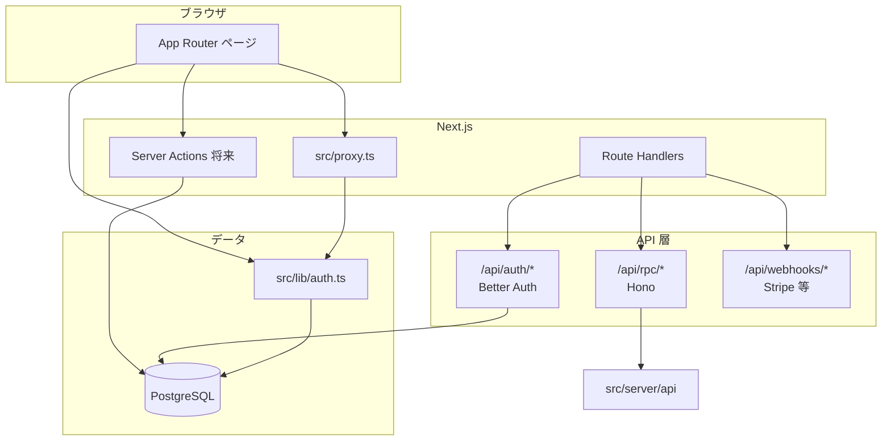

# プロジェクトガイド

`utopi-a.dev`（内部テンプレート名: **utopia-stack**）のリポジトリ構成と技術基盤の説明です。  
環境構築フェーズは完了しており、**アプリの本機能（ブログ CRUD・課金など）はこれから** 実装する前提の骨格です。

---

## このリポジトリの位置づけ

| 項目 | 内容 |
| --- | --- |
| 目的 | 個人の実験場・作品集・ブログ・ミニサービスを載せる full-stack 基盤 |
| 性質 | `utopi-a.dev` 専用だが、他の個人プロダクトにも流用できるスターター |
| 現状 | 認証・DB・UI・Lint・Test・環境変数（Doppler）の**配線済み** |
| 未着手 | ブログ CRUD、課金、AI、本番デプロイの作り込みなど |

---

## 技術スタック一覧

| レイヤ | 採用技術 | 役割 |
| --- | --- | --- |
| フロント | Next.js 16 App Router, React 19, TypeScript | ページ・レイアウト・Server Components |
| スタイル | Tailwind CSS v4, shadcn/ui, CVA, tailwind-merge | UI。CSS Modules は使わない方針 |
| 内部 API | Server Actions（今後） | 画面から呼ぶ CRUD・設定変更 |
| 外部向け API | Hono on Route Handler | モバイル / CLI / 拡張 / Agent 用（将来） |
| 認証 | Better Auth + Drizzle adapter | セッション、GitHub OAuth（env 設定時） |
| DB | Drizzle ORM + PostgreSQL | スキーマ・マイグレーション |
| Webhook | 通常の Route Handler | Stripe など（スタブあり） |
| 品質 | Biome, Lefthook, Vitest | format / lint / pre-commit / 単体テスト |
| 環境変数 | Doppler | ローカル・チーム・Vercel 同期の正 |
| デプロイ想定 | Vercel + マネージド PostgreSQL | Neon / Supabase 等 |

---

## 全体像（リクエストの流れ）



**棲み分けの原則**

| 手段 | 使う場面 |
| --- | --- |
| **Server Actions** | ログイン後画面からのブログ記事作成・設定変更など、Next 内部の操作 |
| **Hono RPC** | 外部クライアントが叩く可能性がある API（将来） |
| **Route Handler（素）** | Better Auth、Stripe Webhook などフレームワーク連携 |

---

## ディレクトリ構造

リポジトリルートから、**何がどこにあるか** を説明します。  
`features/` 配下は「機能単位でまとめる」方針です（`utils/` などの横断フォルダは増やさない）。

```txt
utopi-a-dev/
├── docs/                    # このドキュメント群
├── drizzle/                 # 生成済み SQL マイグレーション
├── public/                  # 静的アセット
├── stubs/                   # Next/Turbopack 用スタブ（better-auth 依存回避）
├── src/
│   ├── app/                 # App Router（ページ・API エントリ）
│   ├── components/          # UI コンポーネント
│   ├── db/                  # Drizzle クライアント・スキーマ
│   ├── features/            # 機能ドメイン（auth, blog, billing 等）
│   ├── lib/                 # アプリ横断の小さな設定・ユーティリティ
│   ├── server/              # Hono API の実装本体
│   ├── test/                # Vitest セットアップ
│   └── proxy.ts             # 認証ガード（Next.js 16 の middleware 後継）
├── biome.json
├── components.json          # shadcn/ui 設定
├── doppler.yaml             # ローカル Doppler 紐付け
├── doppler-template.yaml    # Doppler プロジェクト雛形
├── drizzle.config.ts
├── lefthook.yml
├── next.config.ts
├── package.json
├── vitest.config.ts
└── .env.example             # 変数名の参照用（実値は Doppler）
```

---

## `src/app/` — ルーティングと API エントリ

Next.js の **App Router** がアプリの母艦です。ログイン後エリアは **Lab 配下**（公開ヘッダーに Studio は出さない）。

```txt
src/app/
├── layout.tsx              # ルートレイアウト（フォント・globals.css）
├── globals.css             # Tailwind v4 + shadcn テーマ変数
├── (public)/               # 未ログインでも閲覧可能
│   ├── layout.tsx          # SiteHeader + Toaster
│   ├── page.tsx            # トップ（/）
│   ├── work/page.tsx
│   ├── lab/
│   │   ├── page.tsx        # /lab（Studio パネル）
│   │   └── (studio)/       # proxy でガード
│   │       ├── layout.tsx  # LabStudioShell（戻る・ログアウト）
│   │       ├── studio/page.tsx
│   │       ├── settings/page.tsx
│   │       └── blog/manage/page.tsx
│   ├── blog/page.tsx
│   ├── login/page.tsx
│   ├── forgot-password/page.tsx
│   └── reset-password/page.tsx
└── api/
    ├── auth/[...all]/route.ts    # Better Auth
    ├── rpc/[[...route]]/route.ts # Hono マウント
    └── webhooks/stripe/route.ts  # Stripe（スタブ）
```

### 公開ルートと保護ルート

| パス | グループ | 認証 | 現状 |
| --- | --- | --- | --- |
| `/` | `(public)` | 不要 | トップ・スターター紹介 |
| `/work` | `(public)` | 不要 | Works |
| `/lab` | `(public)` | 不要 | 実験一覧 + Studio パネル |
| `/blog` | `(public)` | 不要 | 公開記事一覧（プレースホルダー） |
| `/login` | `(public)` | 不要 | メール/パスワード + SSO |
| `/forgot-password` | `(public)` | 不要 | パスワードリセット依頼 |
| `/reset-password` | `(public)` | 不要 | トークン付きで新パスワード設定 |
| `/lab/studio` | `lab/(studio)` | **必要** | ダッシュボード |
| `/lab/blog/manage` | 同上 | **必要** | ブログ管理 |
| `/lab/settings` | 同上 | **必要** | アカウント |

`src/proxy.ts` が `/lab/studio`, `/lab/blog/manage`, `/lab/settings` をガードします。

**ブログの URL 設計**: 公開 `/blog` と管理 `/lab/blog/manage` を分けています。

---

## `src/components/` — UI

```txt
src/components/
├── ui/           # shadcn/ui（Button, Card, Dialog, Sheet, Sonner 等）
├── layout/       # SiteHeader（公開）, LabStudioShell（Lab 内 Studio）
└── effects/      # 将来のアニメーション用（現状空に近い）
```

- **スタイル方針**: Tailwind の utility + `src/lib/cn.ts`（`clsx` + `tailwind-merge`）
- **追加コンポーネント**: `pnpm dlx shadcn@latest add <name>`

---

## `src/features/` — 機能ドメイン

画面や API と**一緒に変更するコード**を機能名のフォルダに置きます。

```txt
src/features/
├── auth/
│   └── auth-client.ts      # better-auth/react クライアント
├── blog/
│   └── schema.ts           # Zod（記事入力）+ schema.test.ts
├── billing/
│   └── index.ts            # プレースホルダー
├── profile/
│   └── index.ts
└── lab/
    └── index.ts
```

| 機能 | 中身 | 次に足すものの例 |
| --- | --- | --- |
| `auth` | クライアント | ログインボタン、サーバー側ヘルパー |
| `blog` | Zod schema のみ | `create-post/` などユースケース単位のフォルダ |
| `billing` | 名前だけ | Stripe 連携、webhook 処理 |
| `profile` | 名前だけ | プロフィール更新 |

**新機能を足すとき**: まず `src/features/<機能名>/` に schema・server action・fetch などを置き、ページは `src/app/` から import する。

---

## `src/db/` — データベース

```txt
src/db/
├── index.ts           # postgres クライアント + drizzle インスタンス
└── schema/
    ├── index.ts       # 再エクスポート
    ├── auth.ts        # Better Auth 用（user, session, account, verification）
    ├── blog.ts        # blog_post
    └── billing.ts     # subscription
```

| テーブル | ファイル | 用途 |
| --- | --- | --- |
| `user`, `session`, `account`, `verification` | `auth.ts` | 認証 |
| `blog_post` | `blog.ts` | ブログ記事（slug, title, excerpt, body, published_at） |
| `subscription` | `billing.ts` | 課金（将来） |

マイグレーション:

```bash
pnpm db:generate   # スキーマ変更後
pnpm db:migrate    # Doppler 経由で DATABASE_URL が必要
```

生成物は `drizzle/` にコミット済みです。

---

## `src/lib/` — 横断設定

| ファイル | 役割 |
| --- | --- |
| `auth.ts` | Better Auth サーバー設定（Drizzle adapter, GitHub OAuth） |
| `env.ts` | Zod による env の型・`requireServerEnv` |
| `cn.ts` | className マージ |
| `hono.ts` | Hono `Api` 型の re-export（RPC クライアント用・将来） |

---

## `src/server/` — Hono API 本体

Next の Route Handler は **薄いアダプタ** に留め、ロジックはここに書く方針です。

```txt
src/server/api/
├── index.ts              # Hono アプリの組み立て
└── routes/
    └── health.ts         # GET /health → { ok: true }
```

```txt
src/app/api/rpc/[[...route]]/route.ts
  → handle(api) で Hono に委譲
```

> **注意**: 現状 Hono に `basePath('/api/rpc')` が無く、`/api/rpc/health` が 404 になる既知のずれがあります。修正時は Hono 側のパスと Next のマウントを揃えてください。

---

## 認証の配線

```txt
src/lib/auth.ts                    # betterAuth({ database, secret, github... })
src/app/api/auth/[...all]/route.ts # toNextJsHandler(auth)
src/features/auth/auth-client.ts   # createAuthClient（クライアント）
src/proxy.ts                       # 保護ルートのガード
```

1. SSO は `GITHUB_*` / `GOOGLE_*` / `DISCORD_*` / `TWITTER_*` が揃ったプロバイダだけ有効（`buildSocialProviders`）
2. セッションは PostgreSQL（Better Auth テーブル）に保存
3. ログイン後は `/lab` の Studio パネル → `/lab/studio` 等。サイトヘッダーにログインリンクは出さない
4. メールは `sendAuthEmail`（Resend）。未設定時は dev でターミナルに URL 出力

---

## 環境変数（Doppler）

| 変数 | 用途 |
| --- | --- |
| `DATABASE_URL` | PostgreSQL |
| `BETTER_AUTH_SECRET`, `BETTER_AUTH_URL` | 認証 |
| `GITHUB_*`, `GOOGLE_*`, `DISCORD_*`, `TWITTER_*` | SSO（各 Client ID / Secret） |
| `RESEND_API_KEY`, `RESEND_FROM_EMAIL` | パスワードリセット・メール確認送信 |
| `AUTH_REQUIRE_EMAIL_VERIFICATION` | `true` でサインアップ後にメール確認必須 |
| `STRIPE_SECRET_KEY`, `STRIPE_WEBHOOK_SECRET` | 課金（将来） |
| `NEXT_PUBLIC_APP_URL` | サーバー側のオリジン参照用 |
| `AUTH_ALLOW_SIGNUP` | 新規登録の可否（`true` / `false`）。本番は通常 `false` |
| `OWNER_EMAILS` | オーナー限定機能用メール（カンマ区切り）。空なら制限なし |

Doppler プロジェクト `utopi-a-dev`、config は `dev` / `stg` / `prd`。  
詳細は [README の Doppler 節](../README.md#2-環境変数doppler)。

---

## 品質・開発ツール

| ツール | 設定ファイル | 内容 |
| --- | --- | --- |
| Biome | `biome.json` | format / lint / import 整理。ESLint・Prettier は使わない |
| Lefthook | `lefthook.yml` | pre-commit: Biome + Vitest（軽量） |
| Vitest | `vitest.config.ts`, `src/test/setup.ts` | `src/**/*.test.{ts,tsx}` |
| TypeScript | `tsconfig.json` | `strict: true` |

**テストの現状**

- `src/lib/cn.test.ts`
- `src/features/blog/schema.test.ts`
- `src/features/auth/**/*.test.{ts,tsx}` — パスワードポリシー、env 解釈、エラーメッセージ、Resend 送信、SSO 構成、コールバック URL など

`pnpm test:run` で一括実行。pre-commit でもステージされたテストが走る。

---

## ルート直下の設定ファイル（抜粋）

| ファイル | 説明 |
| --- | --- |
| `next.config.ts` | `serverExternalPackages`, Turbopack の kysely スタブ |
| `drizzle.config.ts` | スキーマパス・マイグレーション出力先 |
| `components.json` | shadcn（New York / Neutral） |
| `package.json` | `dev` 等は `doppler run --` でラップ |

---

## 実装済み vs これから

### できている（基盤）

- Next.js + Tailwind v4 + shadcn/ui
- Route groups（public / app）と `proxy` ガード
- Drizzle スキーマ + マイグレーション SQL
- Better Auth ルート・DB adapter
- Hono の health（パス修正は残タスク）
- Stripe webhook スタブ
- Biome / Lefthook / Vitest
- Doppler 連携

### 意図的にまだやっていない

- ブログ記事の CRUD と Server Actions
- ログイン UI・GitHub OAuth の実運用設定
- 課金・AI
- Vercel 本番デプロイ
- Hono RPC の本格利用

---

## 次フェーズで足すときの置き場（早見表）

| やりたいこと | 置き場の目安 |
| --- | --- |
| 公開ページのデザイン | `src/app/(public)/` |
| ブログ CRUD | `src/features/blog/<ユースケース>/` + `(public)/lab/(studio)/blog/manage/` |
| ログインボタン | `src/features/auth/` + `components/` |
| Server Action | 使う feature 配下、または `src/app/(app)/...` の近く |
| 外部 API | `src/server/api/routes/` + Hono に route 追加 |
| DB カラム追加 | `src/db/schema/` → `pnpm db:generate` |
| 新しい Zod バリデーション | 該当 `features/*/schema.ts` + `*.test.ts` |

ファイル配置の詳細ルール（共通化のタイミングなど）は、チーム／個人の Cursor ルールに沿って、**使われるまで feature 内に閉じる** ことを推奨します。

---

## 関連リンク

- [README（開発の始め方）](../README.md)
- [Doppler CLI](https://docs.doppler.com/docs/install-cli)
- [Better Auth](https://www.better-auth.com/docs)
- [Drizzle ORM](https://orm.drizzle.team/docs/overview)
