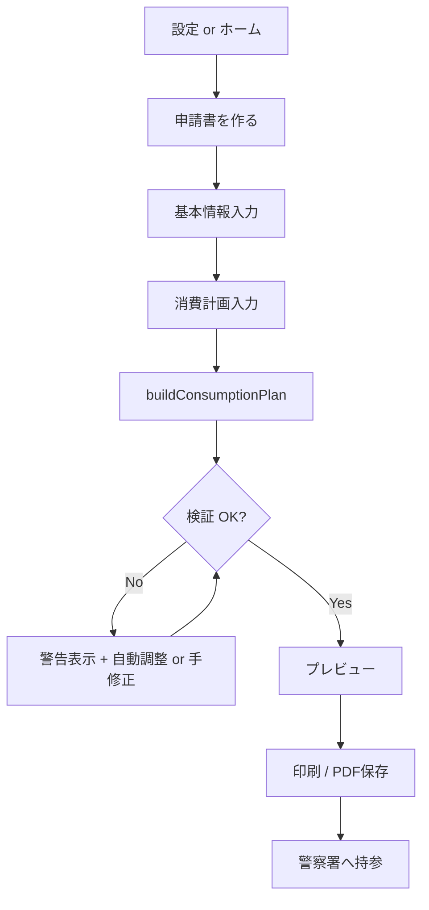

# 譲受許可申請書 PDF オーバーレイ — 実装プラン

## 目的

猟銃用火薬類等の**譲受許可申請**（別記様式第2号 + 別紙）について、ammo-ledger に登録済みのマスタ・在庫・プロフィールを入力源に、**公式 PDF テンプレート上へ座標オーバーレイで値を載せ、A4 100% 印刷できる**機能を追加する。

第1弾のスコープ:

- 別記様式第2号（本体）
- 別記様式第2号（別紙）— 消費計画の自動振り分け含む
- 茨城県警掲載版（令和7年3月1日以降）を正とする

第2弾以降（本プランの対象外）:

- 消費許可（第10号）、譲渡許可（第1号）、銃所持許可（第6号）等

---

## 前提・制約

[茨城県警 申請様式ページ](https://www.pref.ibaraki.jp/kenkei/a06_shinsei/swords_firearms/application.html) の注意事項を UI に明示する。

| 制約 | 実装への影響 |
| --- | --- |
| 公式様式をそのまま使用（罫線変更・拡大縮小不可） | テンプレ PDF/画像を `public/` に同梱。印刷 scale 100% 固定 |
| A4 白無地 | 印刷 CSS で `@page { size: A4 }`、余白なし or 最小 |
| （表）（裏）は両面 | 第2号が両面なら page 2 もテンプレート化 |
| 様式改定 | テンプレートに `version` を付け、改定時は座標マップを差し替え |
| 署名・押印 | オーバーレイ対象外（空白のまま印刷） |

---

## アーキテクチャ概要

帳簿印刷（HTML + `@media print`）とは**別系統**だが、パイプラインの形は揃える。

```
入力フォーム
  → buildConsumptionPlan()        # 別紙行の自動生成
  → buildApplicationFieldValues()   # 様式フィールド名 → 文字列
  → AcquisitionPermitApplicationDocument  # テンプレ背景 + 絶対配置テキスト
  → window.print() / PDF保存
```

### 座標オーバーレイ方式（採用）

**HTML/CSS 絶対配置 + 公式テンプレート背景画像**

1. 公式 PDF を PNG（300dpi 相当、A4 ピクセル寸法固定）に変換し `public/forms/` に配置
2. 各フィールドの `(page, x, y, width, height, fontSize, align)` を TypeScript のフィールドマップとして定義
3. 印刷ビューで `` 背景の上に `<span>` を絶対配置
4. ブラウザ印刷で 100% 出力

**採用理由**

- 既存 `documents/ledger-print-*` と同型（React View + Styles + print）
- キャリブレーション UI を同一 DOM で作りやすい
- サーバー側 PDF 生成ライブラリ不要（初期）
- WYSIWYG に近いプレビュー

**将来オプション**: `pdf-lib` で Blob ダウンロードを追加（Phase 4）。座標マップは共通利用。

---

## ディレクトリ構成

機能単位で `acquisition-permit-application/` 配下に集約する（横断 `utils/` は作らない）。

```
src/features/ammo-ledger/acquisition-permit-application/
├── implementation-plan.md                 # 本ドキュメント
├── acquisition-permit-application-types.ts  # 申請入力・出力の型
│
├── consumption-plan/                      # 別紙：消費計画ロジック
│   ├── consumption-plan-types.ts
│   ├── build-consumption-plan/
│   │   ├── build-consumption-plan.ts
│   │   └── build-consumption-plan.test.ts
│   ├── distribute-acquisitions/
│   │   ├── distribute-acquisitions.ts
│   │   └── distribute-acquisitions.test.ts
│   ├── distribute-consumptions/
│   │   ├── distribute-consumptions.ts
│   │   └── distribute-consumptions.test.ts
│   ├── simulate-home-stock/
│   │   ├── simulate-home-stock.ts
│   │   └── simulate-home-stock.test.ts
│   └── validate-consumption-plan/
│       ├── validate-consumption-plan.ts
│       └── validate-consumption-plan.test.ts
│
├── form-template/                           # 様式テンプレート定義
│   ├── ibaraki-r7-main/                     # 第2号 本体
│   │   ├── template-meta.ts                 # version, pageCount, sourceUrl
│   │   └── field-map.ts                     # 座標マップ
│   └── ibaraki-r7-supplement/               # 第2号 別紙
│       ├── template-meta.ts
│       ├── field-map.ts
│       └── repeating-row-map.ts             # 表の繰り返し行座標
│
├── build-application-field-values/          # 入力 → フィールド値マップ
│   ├── build-application-field-values.ts
│   └── build-application-field-values.test.ts
│
├── documents/                               # 印刷ビュー（ledger-print と同型）
│   ├── acquisition-permit-application-document/
│   │   └── acquisition-permit-application-document.tsx
│   ├── acquisition-permit-application-page/
│   │   └── acquisition-permit-application-page.tsx  # 1ページ分背景+オーバーレイ
│   ├── overlay-field/
│   │   └── overlay-field.tsx
│   └── acquisition-permit-application-styles/
│       └── acquisition-permit-application-styles.tsx
│
├── components/                              # 入力 UI
│   ├── acquisition-permit-application-form/
│   │   └── acquisition-permit-application-form.tsx
│   ├── consumption-plan-editor/
│   │   └── consumption-plan-editor.tsx      # 自動生成結果の確認・微調整
│   ├── consumption-plan-input/
│   │   └── consumption-plan-input.tsx       # 数量・期間・射撃場比率
│   └── acquisition-permit-application-controls/
│       └── acquisition-permit-application-controls.tsx  # 印刷ボタン等
│
└── calibration/                             # 開発者向け座標調整（dev のみ）
    ├── field-calibration-view/
    │   └── field-calibration-view.tsx
    └── export-field-map/
        └── export-field-map.ts

public/forms/acquisition-permit/ibaraki-r7/
├── main-page-1.png
├── main-page-2.png          # 裏面がある場合
├── supplement-page-1.png
└── README.md                # 入手元 URL・変換日・dpi

src/app/(public)/lab/(studio)/ammo-ledger/
└── applications/
    └── acquisition-permit/
        ├── new/page.tsx                     # 申請書作成（入力）
        ├── print/page.tsx                   # 印刷プレビュー
        └── calibration/page.tsx             # dev: 座標キャリブレーション
```

---

## ルーティング・ナビ

| URL | 役割 |
| --- | --- |
| `/lab/ammo-ledger/applications/acquisition-permit/new` | 申請入力フォーム |
| `/lab/ammo-ledger/applications/acquisition-permit/print` | 印刷プレビュー（searchParams で入力を受け取る or sessionStorage） |
| `/lab/ammo-ledger/applications/acquisition-permit/calibration` | 座標調整（`NODE_ENV=development` のみ） |

**導線**

1. 設定ハブ「帳簿」グループに **譲受許可申請書** を追加
2. `/settings/permits` 一覧各行に **申請書を作る** リンク（既存許可をベースにプリフィル）
3. ホーム「帳簿の準備」にショートカット（任意）

---

## データモデル

### Phase 1: DB 変更なし（申請ドラフトはクライアント state）

申請書作成は**帳簿への記録ではない**ため、初版は永続化しない。

- 入力 state → `sessionStorage` または URL エンコード（小さい場合）
- 印刷ページは searchParams / sessionStorage から復元
- 既存 DB から**読み取る**のみ: profile, guns, ranges, counterparties, ammoTypes, 現在在庫

### Phase 3（任意）: ドラフト保存

需要が出たら `ammo_application_draft` テーブルを追加。

```
id, userId, formKind, payloadJson, createdAt, updatedAt
```

---

## 入力スキーマ（Zod）

`schema/acquisition-permit-application-schema.ts`（feature 直下ではなく、複数 form で共有する前は `acquisition-permit-application/` 内に置く）

### 申請共通

| フィールド | ソース | 備考 |
| --- | --- | --- |
| `ownerName` | profile / 手入力 | 必須 |
| `ownerAddress` | profile / 手入力 | 必須 |
| `ownerBirthDate` | 手入力 | 様式要確認 |
| `ownerPhone` | 手入力 | 様式要確認 |
| `applicationDate` | デフォルト今日 | 提出日 |
| `ammoName` | acquisitionPermitNameOptions | 12番 等 |
| `permitPurpose` | acquisitionPermitPurposeOptions | 標的射撃 等 |
| `ledgerPurpose` | ledgerPurposes | 帳簿分冊との対応 |
| `requestedQuantity` | 数値 | 申請数量（発） |
| `validFrom` / `validTo` | 日付 | 許可証有効期間 |
| `counterpartyId` | counterparty マスタ | 譲渡者（店） |
| `gunIds` | gun マスタ（複数可） | 使用銃 |
| `currentHomeStock` | 在庫計算 or 手入力 | 800 発制約用 |

### 消費計画入力（別紙自動生成用）

| フィールド | 説明 |
| --- | --- |
| `planPeriodFrom` / `planPeriodTo` | 消費計画の対象期間（通常 validFrom〜validTo と同じ） |
| `rangeAllocations` | `{ rangeId, purpose?, weight }[]` — 射撃場ごとの配分比率 |
| `purchaseUnit` | 固定 250 |
| `consumptionUnit` | 固定 25 |
| `homeStorageLimit` | 固定 800（`homeStorageRoundLimit` を参照） |
| `allowPartialPurchaseUnit` | 端数 250 未満を許すか（デフォルト false） |

---

## 消費計画アルゴリズム

### 定数

```typescript
const purchaseUnit = 250;
const consumptionUnit = 25;
const homeStorageLimit = 800; // homeStorageRoundLimit
```

### 出力行（ConsumptionPlanRow）

```typescript
type ConsumptionPlanRow = {
  rowIndex: number;
  date: string;              // YYYY-MM-DD
  locationName: string;      // 射撃場名
  locationAddress: string;
  purpose: AcquisitionPermitPurpose;
  consumptionQuantity: number;  // 25 の倍数
  acquisitionQuantity: number;  // 250 の倍数（0 も可）
};
```

### 処理ステップ

```
Step 1: distributeAcquisitions
  - requestedQuantity を 250 発単位に分割
  - 期間内に均等配置（月1回、隔月等 — UI で選べる interval）
  - 出力: AcquisitionEvent[] { date, quantity }

Step 2: distributeConsumptions
  - 総消費量 = requestedQuantity（許可数量は基本的に全部消費予定）
  - rangeAllocations の weight に比例して射撃場へ配分
  - 25 発単位に丸め。端数は最大 weight の射撃場へ
  - 各 acquisition の後に消費が追いつくよう日付を配置（在庫が膨らみすぎない）

Step 3: simulateHomeStock
  - 初期在庫 = currentHomeStock
  - 日付順に acquisition を加算、consumption を減算
  - 各時点で homeStock <= homeStorageLimit を検証
  - 超過する場合: 超過日前に consumption を前倒し（25 発刻み）

Step 4: validateConsumptionPlan
  - sum(acquisition) === requestedQuantity
  - sum(consumption) === requestedQuantity
  - 全 quantity が単位倍数
  - peak home stock <= 800
  - 別紙1枚あたり最大行数（様式調査後に定数化）を超えたら page break 用に分割

Step 5: buildConsumptionPlan（オーケストレータ）
  - 上記を合成して ConsumptionPlan を返す
  - warnings[]（端数調整、行数超過など）を付与
```

### 調整 UI

自動生成後、`ConsumptionPlanEditor` で行単位の編集を許可:

- 日付・数量・射撃場の手修正
- 編集のたびに `validateConsumptionPlan` + `simulateHomeStock` を再実行
- 800 発超過時は行をハイライト

---

## フィールドマップ設計

### 型

```typescript
type FieldAlign = "left" | "center" | "right";

type OverlayFieldDef = {
  id: string;
  page: number;
  x: number;       // mm または px（基準解像度で統一）
  y: number;
  width?: number;
  height?: number;
  fontSize: number;
  align?: FieldAlign;
  maxLength?: number;
  multiline?: boolean;
  lineHeight?: number;
};

type FormTemplate = {
  id: string;
  version: string;
  label: string;
  sourceUrl: string;
  pageWidth: number;   // A4: 210mm → px 換算基準
  pageHeight: number;  // 297mm
  pages: { imagePath: string }[];
  fields: OverlayFieldDef[];
  repeatingRows?: {
    startY: number;
    rowHeight: number;
    maxRowsPerPage: number;
    columns: { id: string; x: number; width: number; fontSize: number }[];
  };
};
```

### 座標系

- **基準**: A4 210×297mm を `@page` 固定
- フィールドマップは **794×1123 px**（96dpi 換算）または **mm 単位**で記述し、描画時に CSS `mm` で変換
- mm 推奨: 印刷ズレに強い

### キャリブレーション手順（初回 + 様式改定時）

1. `calibration/page.tsx` でテンプレ PNG 上にフィールドをドラッグ配置
2. 開発者が目視確認後、`export-field-map.ts` で `field-map.ts` 用 JSON/TS を出力
3. 実機印刷（Chrome / Safari）で 100% スケール確認
4. ズレがあれば mm 単位で微調整

---

## UI フロー



### 画面構成

**new ページ**

1. 基本情報（プロフィール自動入力、不足は警告）
2. 許可内容（名称・目的・数量・期間）
3. 譲渡者（counterparty ピッカー — 既存 `MasterPicker` 流用）
4. 使用銃（複数選択 — checkbox list）
5. 消費計画
   - 期間
   - 射撃場と配分（range ピッカー + weight slider）
   - 現在の自宅在庫（`computeStock` からデフォルト、上書き可）
   - 「計画を生成」ボタン
6. 生成結果テーブル（ConsumptionPlanEditor）
7. 「印刷プレビューへ」

**print ページ**

- 第2号 本体（1〜2ページ）
- 別紙（N ページ — 行数に応じ自動）
- 注意書き（公式様式そのまま、100% 印刷、署名は手書き）
- 印刷ボタン

---

## 既存コードとの接続

| 既存 | 使い方 |
| --- | --- |
| `getLedgerProfile` | 氏名・住所 |
| `resolveOwnerName` | フォールバック |
| `listGuns` | 使用銃一覧 |
| `listRanges` | 消費計画の射撃場 |
| `listCounterparties` | 譲渡者 |
| `computeStock` / entries | 現在在庫 |
| `homeStorageRoundLimit` | 800 発定数 |
| `acquisitionPermitNameOptions` | 名称 |
| `acquisitionPermitPurposeOptions` | 目的 |
| `MasterPicker` | range / counterparty 選択 |
| `AmmoLedgerPanel`, `Button`, `Input` | UI 部品 |

---

## 実装フェーズ

### Phase 0: 様式調査（コード前）

- [ ] 茨城県警 PDF（第2号・別紙）をダウンロード
- [ ] フィールド一覧を洗い出し（手書き欄 / 記入欄 / チェック欄）
- [ ] 別紙の表: 列定義・1ページ行数・繰り返し構造
- [ ] PNG 変換して `public/forms/` に配置
- [ ] 両面要否の確認

**成果物**: フィールドインベントリ表（`form-template/` のコメントでも可）

### Phase 1: 消費計画ロジック（PDF なし）

- [ ] `consumption-plan/` 配下の純関数 + テスト
- [ ] CLI または Vitest の fixture で数量パターン検証
- [ ] 800 / 250 / 25 制約のエッジケーステスト

**完了条件**: `buildConsumptionPlan` が典型入力（5000発・1年・2射撃場・在庫300）で妥当な行を返す

### Phase 2: フィールドマップ + キャリブレーション

- [ ] `FormTemplate` 型定義
- [ ] 第2号本体の主要フィールド座標（氏名・住所・数量・期間・相手方）
- [ ] 別紙 repeating row 座標
- [ ] calibration ページ（dev only）
- [ ] 実機印刷で位置確認

**完了条件**: ダミー文字列が様式の枠内に収まる

### Phase 3: 入力 UI + 印刷ビュー

- [ ] `new/page.tsx` フォーム
- [ ] `build-application-field-values`
- [ ] `AcquisitionPermitApplicationDocument`
- [ ] `print/page.tsx`
- [ ] 設定ハブ・permits ページからの導線

**完了条件**: E2E で入力 → プレビュー → print dialog まで到達

### Phase 4: 仕上げ

- [ ] 注意書き・バリデーションメッセージ
- [ ] プロフィール未設定時のガード
- [ ] 別紙複数ページ対応
- [ ] （任意）pdf-lib による PDF ダウンロード
- [ ] （任意）申請ドラフト DB 保存

---

## テスト戦略

| レイヤ | 内容 |
| --- | --- |
| 単体 | `build-consumption-plan`, `simulate-home-stock`, `validate-consumption-plan`, `build-application-field-values` |
| 単体 fixture | 5000発/250=20回購入、在庫300→peak<=800、端数なし |
| 単体 edge | 250発申請、800在庫で追加不可、1射撃場100%、行数オーバー |
| 結合 | フォーム入力 → field values が expected keys を持つ |
| 手動 | 実印刷 100% で枠ズレなし（Phase 2 以降 кажды様式改定時） |

---

## 依存パッケージ

| パッケージ | 用途 | タイミング |
| --- | --- | --- |
| なし（Phase 1-3） | HTML/CSS print | 初版 |
| `pdf-lib` | PDF Blob 出力 | Phase 4 任意 |

`pdf-parse` は既存（seed 用）。申請書生成には使わない。

---

## リスクと対策

| リスク | 対策 |
| --- | --- |
| 様式改定 | `template-meta.version` + README に入手日。古い版は非表示 |
| ブラウザ印刷ズレ | mm 座標、@page margin 0、100% 固定ガイド |
| 別紙行数不足 | 複数ページ生成 + UI 警告 |
| 県差 | 初版は茨城固定。`form-template/` を県ごとに分け将来拡張 |
| 法的責任 | UI に「提出前に内容を確認」の免責。自動生成は補助 |

---

## 未決事項（Phase 0 で確定）

1. 第2号本体の全フィールド一覧（生年月日・電話・銃許可番号の記載欄有無）
2. 別紙の列: 購入/消費の両方か、消費のみか
3. 別紙 1 ページあたりの最大行数
4. チェックボックス（目的等）の記入方法 — 文字「✓」か枠塗りつぶしか
5. 茨城以外のユーザーを想定するか（テンプレ選択 UI）

---

## 最初の PR 粒度（推奨）

| PR | 内容 |
| --- | --- |
| PR1 | Phase 0 成果物（PNG + フィールドインベントリ）+ Phase 1 消費計画ロジック |
| PR2 | Phase 2 フィールドマップ + calibration + ダミー印刷 |
| PR3 | Phase 3 入力 UI + 本番印刷フロー + 導線 |

PR1 からマージ可能な状態にし、消費計画ロジックは PDF なしでも単体価値がある。
